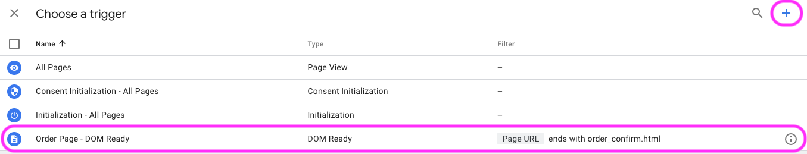

# google-tag-manager-conversion-tag
Google Tag Manager Template for SafeOpt Conversion Tag

**NOTE: This is only 1 of 2 templates that must be used to correctly configure SafeOpt tags on your site**

**Must Also Install and Configure SafeOpt - Global Site Tag**

SafeOpt - Global Site Tag: [https://github.com/addshoppers/google-tag-manager-global-site-tag](https://github.com/addshoppers/google-tag-manager-global-site-tag)

### Information
- Template name: SafeOpt - Conversion Tag
- Brand: [SafeOpt](https://www.safeopt.com/)
- Works with: Google Tag Manager (must be setup to work with your site)
- Install method: 
    - Google Tag Manager Community Template Gallery 
    - Import template into Google Tag Manager
- Version: 1.0.0
- Developer: [Addshoppers](https://www.addshoppers.com/) 
- Contact: [help@addshoppers.com](mailto:help@addshoppers.com)

---

### Description
This is a Google Tag Manager (GTM) that installs the SafeOpt Conversion Tag your site.  You must have Google Tag Manager correctly configured for the SafeOpt tags to work on your site.  Google Tag Manager variables for order value and order ID are required for a successful setup.  Please reference Google Tag Manager documentation for support on variable setup.

**NOTE: Please contact [help@addshoppers.com](mailto:help@addshoppers.com) if you need support.**

---

### Install Steps

1. Click on Tags on the right menu bar in your Google Tag Manger (GTM) account 

2. Click the New button

3. click on the tag to configure

4. Click on Discover more tag types in Community Template Gallery

5. Click on search and look for SafeOpt

6. Select SafeOpt - Conversion Tag template from community gallery

7. Click on Add to Workspace

8. Click Add

9. Name Tag `SafeOpt - Conversion Tag`

10. Select correct variables for the following files:
    - Value (required): subtotal value for the order (before tax and shipping)
    - Order ID (required): unique order ID
    - User Email (optional): user email associated with order
    - Currency (optional): order currency (set to Hard Code Currency for static currency)
    - Currency Hard Coded (optional): set ISO 4217 currency code for static currency
    - Offer Code (optional): one offer code used for order
    
    for optional fields select `Not Available` if no variable is available in GTM 

 **Contact [help@addshoppers.com](mailto:help@addshoppers.com) for support**

11. Click anywhere in the Trigger box to configure trigger

10. Select an existing trigger (if you created one previously) or build a new trigger

please see GTM documentation for help with trigger creation

**NOTE: the trigger needs to only fire once on the order confirmation,or thank you page, etc. please create the required trigger in GTM**

11. Click the save button

12. Submit and Publish Changes

13. Verify tag is installed correctly by creating a test order and checking for `AddShoppersConversion` object in console on the order confirmation page

**NOTE: Value and Order ID fields are required**

### GitHub Repo Notes

Templates are created and updated in Addshoppers GTM account.  

When a new version is release please do the following:
1. export updated template from GTM
2. Replace the current `template.tpl` file with updated file (must use this name)
3. update readme.md with the latests version and any other updates required
4. update `metadata.yaml` with the latest version and SHA value

More Info at: [GTM Repo Requirement](https://developers.google.com/tag-platform/tag-manager/templates/gallery)
